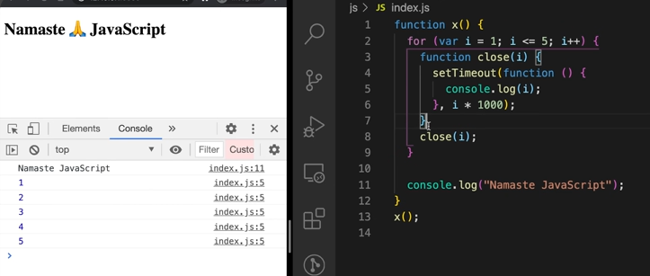

# Namaste Javascript 🙏 S1+S2
## 1. How Javascript works - Execution Context

> "Everything In JS happens inside Execution context".
- Execution context is like a container or box in which JS code is executed.
- It has two Components in it - 
    1. Memory Component or Variable Environment
    2. Code Component or Thread of Execution
- **Memory Component** - It is a sort of environment where variables and functions are stored in Key value pairs.
- **Code Component** - This is the place where code is executed line by line (one line at a time).

>"Javascript is synchronous single threaded language"
- Javascript can Execute One Command at a time in a specific order.

## 2. How JS code is executed?

### Steps to execute a JS code.

1. Gloabal Execution context is created.
2. Execution Context created in two phases 
    - Memory creation Phase
    - Code Execution Phase
3. In Memory Execution phase memory is allocated to variables and functions.
4. Js Skims through the program allocates memory to every varibles and function 
5. for variables a special value undefined is allocated to it.
6. for functions it allocates the whole code. as key value pair.

7. Now for the Code Execution Phase JS goes line by line and executes the code now.
8. So, when the function call happens a brand new execution context is created for it.
9. Which will again have a memory component and a code component and will execute in same 2 phases.

10. return is a special keyword which sends the returned value to the execution context where function was invoked.
11. Once the function is executed the execution context of the function will be removed.

12. *Square4 will get the value 16 and then execution context of the second call will be deleted. 

13. This is how whole code runs.

### How JS manages all these ?

1. this is managed by JS very efficently by using a Stack called as Call Stack.
2. Every time in our stack we have our Global Execution Context at the bottom.
3. Everytime a function is called new execution context is created on top of the other. 
4. once the function is returned the exec. context is popped out of the stack
5. after all the code execution global exec. context is popped out of the stack and call stack will be empty.

> "Call Stack maintains the order of execution of execution contexts"

- Fancy Names for call stack-
    + Execution context stack
    + Program Stack
    + Control Stack
    + Run-time Stack
    + Machine Stack

## 3. Hoisting in JS
- Hoisting is a phenomenon in JS by which we can access the variable and functions even before it was initialized , we can access it without any error.
- for variable due to memory creation phase it will have the value as undefined  
- when you call a function it will automatically will execute with the result because the whole fucntion is already being stored with the function name during the memory creation phase.
- Arrow function act as a variable only it stays undefined until it is called.

## 4. How functions execute.(Imp Points only)

> Console O/P : 10 100 1

- JS doesnt get confused when there are  x declared times inside our code

- Because each function has their own execution context and they will have thier own memory creation phase so each x will be created inside thier respective execution context.
- after the function call is finished it will remove the execution context and its respective memory allocated variables or functions.
- JS engine and call stack handles this very efficiently. So the funtional x will have thier own value for a() - 10, b() - 100 , and the global x will finally console.log at line number 4 as 1

## 5. Shortest Js Program , Window, This

- Shortest program in JS is the blank JS file or you can say for example blank index.js JS file.

- Even when it is an empty JS still Global context Gets created also sets up the memory space. 

- With Global context it Creates a Global Object window and a keyword this.

- In global scope this points to Global Object, So we can say -
> this===window // true

- window is a object that has many functions and variables in it which is created by JS engine

- Global object in Browsers Js engine is window
- Global space is the code which is not inside the fucntion
- The variables and functions we create in global space gets attached the global object.
- Like in the following image a and b is there in global object not x.

- to access this values from global object we can use window.(variable or fucntion name) or simply the (name) Js assumes we are saying window.(name) , or we can also use this.(name)

> console.log(window.a) //10
> console.log(a) //10
> console.log(this.a) //10
> console.log(x) // refrence error as it is not a part of window object.

## 6. undefined vs not-defined
- undefined is a placeholder which is being assigned to a variable when execution context is created and memory creation phase is done.
-not-defined is something for which memory is not allocated.
-undefined is not empty it is a special keyword that acts as placeholder until the variable is assigned some other value

- JS is a loosely typed or weakly typed language.
- we can put every data type inside a variable it can be string it can be number or boolean anything.

- Not a best practice assigning a varibale to undefined in code.
>var a = undefined;

- because undefined has specific purpose which is to say that the variable was not assigned with a value. its bad practice.

## 7. Scope chaining and Lexical environment.
- Scope in Js is directly related to lexical environment.

- **Scope** - Scope means where you can access the specific function or a variable. scope of the varible or scope of the function.

- **Global Variables**- Varibales inside global context is called global variables. and it can be accessed from anywhere in program (we will know how).

- **Lexical Environment**- Whenever a Execution context is created Lexical environment is also created. Lexical Environment is the local memory and Lexical environment of its parent (lexical means in hierarchy or in sequence).
>Lexical env = local Memory + Lexical env of parent

> [!NOTE]
> The c() function is Lexically inside a function.

- Whenever Exec. Context  is created a Lexical Environment reference of parent also get created inside it.

- **Scope Chain** - The way of finding values from own lexical envrioment to its parents lexical environment and this goes on until it reaches the global environment which points to null.

- So Here we can see the Lexical environment of c( ) points to a( ).
> Sequence of Scope chain- c()->a()->Global->null.

## 8. let, const in JS and Temporal Dead Zone.

> let and const are hoisted but they are hoisted bit differently than var.

- let and const remain in temporal dead zone for time being.

- Whenever we try to access let or const before it is declared we get a reference error that says "RefrenceError: Cannot access (variable_name) before initialization".

- So in the below image we can see that let and const are hoisted but they declared in separate memory space not in global memory space like var. that is why they are not accessible before initialization.

- **Temporal Dead Zone** - it is the time between the let/const was hoisted and  it was initialised with some value.

- Whenever we try to access a variable that is not defined in the code we get a diffrent reference not the same error as let value accessed before initialization.

- for window object and this cannot access the value of let and const because they are not part of the global space like vars. so they give undefined like for all the undeclared variables.

- let is bit strict than var so if we try to redeclare the same variable using let or var we get a syntax error and it not even executes single line of code.

>let a=10 ; var a=1000 ;let a=200 // these will give error.

- const is more strict than let we have to initilize const variable at same line it is declared. it will give syntax error

>const b; b=20; // will give error

- if we want to assign any value later in the const it will give a diffrent error called type error.

> const b=100; b=20 // will give error

- When to use which variable.
    - **const**- whenever there is a constant value through out the program use const best to use cause it is very strict.
    -  **let**- if the value is changing use let it is less strict than const , it has TDZ  so you wont get into the issues of undefined etc.
    - **var**- Keep var aside normal coding doesnt requires var but there are few special cases where we can use var.

- Always keep your declartions and initialization at top of the scope to avoid TDZ errors.

## 9. Block Scope.

>[!NOTE]
> "let and const are block scoped"

- What is Block?
    - Block is defined by {} these two curly braces this is a perfectly valid JS code.
    - Block is also know n as compound statement it helps to combine multiple JS statements in one group.
    - we need to group the statement because 
    - we group multiple statements in a block so we can use it where JS expects single statement.

    

- We use it in loops conditions etc. 
- Block scope means variables or functions we can access inside block.

- We can see in the above image that let and const are not part of global scope they are part of Block scope completely separate from global object where as var is inside the global scope.

- let and const are hoisted in a diffrent space that is reserved for this block "{}" and var is hoisted in the Global scope.

-  let and const are not accessible outside this block so that is why they are called block scoped.

- What is Shadowing ?
    - if you have same variable inside the block it shadows the variable outside. executes the value inside.

    

    - The above image shows shadowing exapmle.
    - [exclusively for var] even if we get out of the block scope and try to log the value it will show us the value which was inside the block as var is inside the global scope and both are pointing to same memory location inside Global object. 
    - for let and const situations are different.
    
    

    - So we can see there are two separate values of ab inside two diffrent scope.
    as we know that let and const are block scopic.
    - inside the block the same variable ab shodowed the value of ab which exists outside the block. 

    - but if we log outside the block where block scope is ended it will take the script scope value of ab.
    - concept of shadowing is not only for block scopes it for functions to remeber functions has this -{}.

- What is illegal Shadowing?
    - if you are shadowing a let variable with var then it is illegal shadowing
    >[!CAUTION]
    > let a=10; {var a=100 } //Illegal Shadwing will give syntax error "a is already been declared"

    - if a variable is shadowing something it should not cross the boundary of its scope as we know var is in the global scope so it persists the value even after the block.
    - var is a function scope if we do this inside a function there wont be any error.

- you can shadow let using let, var using let(inside block)

- Block Scope also follows lexical scope.

- like it checks in its own block if it finds the value it logs or else it checks in its lexical parent.

- examples of scope chaining in block scope.

- scope rules are same for arrow and normal functions.

## 10. Closures

- This is what closure is.

- A closure is a function bundled together with its lexical environment.

- So in the above example function y is bind to the varibles of x. it forms a closure and it has access to its parent lexical scope.

- Functions are really powerful in JS.
    1. Functions can be assigned to variables.
    2. Functions can be passed as parameters in a function
    3. we can also return the function inside a function.

- how will the function y behave as it is out of its lexical scope.when z will be called outside the function which doesnt have a reference of what a is . if we call z(); what will it print.

- it will print 7 because when functions are returned they still maintains thier lexical scope. they remember where they were present. not only just the function was returned the whole closure was returned.

- cool developers like to write like this instead of return y they write.

- Closures comes with lot of corner cases.

- Here output will be 100 beacuse when y is returning, it is returning with reference of "a" not the value of "a", if the value at "a" changes updated value will get diplayed as output when y is called.

- There can be multiple layer of function it will be a function with refrence of its parent , parent's parent , it goes on till the top level and making it a closure.

- Uses of Closure:
    - Modern Design Pattern.
    - Currying
    - Fucntion like once
    - memoize
    - maintaining state in async world.
    - setTimeouts
    - Iterators
    - many more.

## 11. setTimeout + closures

>[!NOTE]
>This chapter will have some imp interview questions on setTimeout and closures.

-setTimeout call back function forms a closure. it have access to its lexical scope. wherever the function goes it will have access to its lexical scope.

-setTimeout takes the call back function and stores it to some place and attaches a timer to it and js goes on to the next line.
when the timer expires it calls the function inside the timeout.

Why it prints all 6

- because in the callback function remembers the reference to i and when the loop breaks at i=6 because its not greater than 5 it prints all the value 1 by 1 to 6 which is the value of i now.

- all the iterations point the same refernce after the timer is completed. and js doesnt wait for timer to complete then execute the loop ... it completes the looping before timer ends. and and when i checks for its value in its scope and its lexical scope it logs 6. as we know that var is function scoped not block scoped {} we could have use let instead.

- if we want to fix it using var we can use iife or a function which we can call which wraps the set timeout ;just before the for loop ends. and i is passed as parameter to that function like the image below.

## 12. Interview Questions(JS/Closures)

 1. What are closures?
    - Function along with its reference to its outer environment is closures.
    - Function bundled together with its lexical scope.
    - explanation : each js function has acess to its varibles and function present in its parent scope.
    So even when this function is executed in a diffrent scope not in its original scope. it still rembers its outer lexical environment where it was present in the code.
    - examples:

    > function outer(){  
    >   var a=10; 
    >    function inner(){ 
    >    console.log(a) 
    >}
    > return inner; 
    >} 
    >outer()(); 

2. What is the use of ()() in JS ?

    - it is used to call the inner function which is returned.

    - outer(); just this call will return the inner function.
    - outer()(); will execute inner function at the same line itself. 
    - we can also write like this. 
        - const display = outer();// display will contain the return of inner function
        - display();// this will call the inner function.  
3. Will it be still closure if we change the postion of var a=10; ?

    > function outer(){  
    >   
    >    function inner(){ 
    >    console.log(a) 
    >}
    >   var a=10; 
    > return inner; 
    >} 
    >outer()(); 

    - Yes, it will be still closure because position of the varibale doesnt matter until and unless it is in the lexical scope of inner function. but if its placed after return then the value will be undefined as when inner is executed value of a is not yet 10;

    > 10  // it will be output of closure

4. will it be still closure if we make it let ?

    - Yes, it will be still closure because let also remembers the value in its lexical scope.

5. What happens if we pass a parameter b in the outer function ?

    > function outer(b){  
    >   
    >    function inner(){ 
    >    console.log(a,b) 
    >}
    >   var a=10; 
    > return inner; 
    >} 
    >outer("Hello")(); 

    - Yes, it will still be in closure. we can access both a and b inner function will have refrence of both. b is also part of outer environment. it will print 

    > 10 "Hello"

6. What happens if the outer function is nested inside outer function so will the inner function stil be closure of outer most function?

    - Yes, As we know closure is function binding with its lexical scope, so yeah inner function will be in closure with the outermost function.

7. What will happen if we create a conflicting variable in global scope like let a=100?
   > function outer(b){  
    >   
    >    function inner(){ 
    >    console.log(a,b) 
    >}
    >   var a=10; 
    > return inner; 
    >} 
    > 
    >let a=200; 
    >outer("Hello")(); 

    - As, both the variables are declared in a diffrent scope they wont effect each other.
    value of a will be still 10. if we comment out the line where var a=10; then it will search for a in its scope then in the parents scope finally will get the value of global scope.
    - if a is not at all decalred then it will give reference error.

8. Few advantages of closures ?

    - module pattern
    - data hiding and encapsulation.
    - Function currying.
    - in hogher order function memoize and once.

9. What is data hiding how it works with closure?
    - Suppose we have a variable we want to have data privacy over it so other functions and other variables cannot manuplate the value and cannot access it directly.

    - So, here as we can see that any-one can change the value of counter as it is declared globally.

    - here comes data hiding or data encapsulation into picture. we have to ensure that nobody in the program can change the value of counter.
    - So, we want to ensure that nobody else except increase counter can only change the value of counter.
    - to achieve that we will use closure, and will wrap it inside a function.

    

    > [!WARNING]
    > We have changed the variable name from counter to count as we have kept counter as function name.

    - So here we return the incrementCounter() function so we can only modify the data with that function only or else it cant be modified in any way.

    - When we call the counter1 function it will give us the value 1 incremented from the zero.
10. so if we call the counter function again like counter2 = counter();

    - this will create a new counter out of it. it wont persist the last called value of counter1 so , this counter can be resused. and it will start from 1 again.
    - because both have diffrent scope this will again form closure with the new counter.
    - wheneever this counter function will called it will create a new counter , and will start with output 1.

11. Is this a good way to create a counter is it scalable? if you want to add decrement counter also.

    - This is not a good way if we want to create a decrement counter also.
    - We can use a Constructor function. inside it we can have separate incerement and decrement function.
    
    

    - We create two functions inside constructor this.incrementCounter and this.decrementCounter.

    - Now this a goodway to implement it.
    - Now if we want to create a new counter we just have to write counter1= new Counter(); this gives us access to the increment-decrement functions and still our data remains private.
    - so when we write counter1.icrementCounter(); it increments the counter and same for decrementCounter();
    - whenever we need to call our constructor we will use new Keyword and general naming convention of the constructor starts with a capital letter "Counter". 

12. Disadvantages of closures?
    - There can be over-consumption of memories when we use closures. 
    - those closed over variables are not garbage collected efficiently.
    - it will accumulate a lot of memory  if we create a lot of closures in our code. because those are not garbage collected till the program expires.
    -if these are not handled properly it will lead to memory leaks. because the memory is accumulated over time it can also freeze the broswsers if not handled properly.

13. What is a garbage collector ? 

    - Grabage collector is a program in Browser or in JS engine, which frees-up the unutilised memory

    -Js is high level programming language. In languages like C and C++ we(developers) have to allocate or deallocate memmory but in JS most of the work is done by JS engine.

    - So Garbage collector takes out the  un-used variables and functions and frees up the memory. when ever JS engine finds out that these are no longer needed.

14. What is the relation between closure and garbage collector?

    - Lets learn it with an example.

    > function outer(){  
    >    function inner(){ 
    >    console.log(a) ;  
    >}  
    >   var a=10 ; 
    > return inner ; 
    >} 
    > const caller= outer(); 
    >caller(); 

    -So, ideally what would happen without closure the function outer will get called and after its called all its memory should be removed and garbage collected. but when its closure the var a in outer function will stay even after its execution is over. so it means it cannot free up the variable a.
    - value of inner is now copied to caller so value of a is not freed even after it is executed, it will be free after sometime later when the caller will be called.

    - But some of the modern browsers and JS engines like V8 in chrome they have smart garbage collection mechanism. when it somehow finds that some of the closure variables are not used or unreachable then the garbage collector collects it smartly.

15. What is smart garbage collector ?

    

- So like here when b is called only x is used in closure z is not used so , smart garbage collectors smartly remove z from the memory as its not used.

- So if we pause our code at line no. 4 and try to access both z and x , z will give error because it was silently removed by smart garbage collector.

- So z is no longer in the memory!, when it happened? when a was called it was removed by the Garbage collector. as it has no use.

>[!IMPORTANT]
>There are two codes below both performs data hiding we will see how it works and we know from above which one is scalable.

- So here we can see both are different apporoaches of data hiding or encapsulation. as we know from earlier that constructor one is more scalable in terms of adding features to the Counter.

- So the major diffrence between two is how they are returned. So in constructor when we create a new variable and write counter1=new Counter, so here counter 1 is a object so new object counter 1 is created and the "this" keywords points to counter1 so we can access both the increment and decrement function like counter1.increment();/counter1.decrement(); and we want our object to access the helper functions we have to create function expressions or arrow functions normal function declarations dont work it works as a stand alone not a constructors method.

- So in Second Scenario we can see the increment function is returned and this captured inside the counter 1 variable so when we call the counter variable (outside function) it assign the whole function with its lexical scope to the counter 1 variable so here counter1 is a function.
so, if we want to execute the incerement function and update the value of count we have to call the counter1(); function. or if we dont want a new variable we can call it like this counter()(); it will increment the value.

>Console(output):  
>   `9`  
>   `11`

## 13. Functions types

- Function Statement
    - it nothing but just writing keyword function and giving it a name.

    
    

    - This way of creating function is called statement.
- Function Expression.
    - you can assign it to a variable , like you are initializing a value which is a function its unique feature in JS. this feaure is called function expression.

- Both of these are way to write functions.

- Difference between Function Expression and Statement.

    - hoisting happens diffrently.
    ;

    - So in function statement it can be callled anywhere from the code because during memory creation phase whole function put inside memory here function a is assigned to memory but for the function expression that is treated as a variable it remains undefined till it is initialised with function. so when b is called before it is initialized it gives an error that b is not a function.

-  Function Declaration.
    - Function statement is also known as Function decalaration.
- Anonymous Function
    - Function without a name is anonymous function.
    - Anonymous Func. does not have thier own identity, it cannot be declared as a function statement.
    - it can used in function expressions or when functions are used as a value.
    

- Named function expression
    - when we name the function used in expression.
    - there is a corner case for named function expression. if call by the function name not by the variable it will give error.

    
    - because when we are calling xyz it is out of its scope it is not present in outside scope. it is created as a local variable.

- Parameter and Arguement.
    - parameters and arguements are different.
    - whatever some labels are passed inside function statements inside those parenthesis function a(n1,n2){} are called parameters
    here n1 and n2 are parameters. 
    - during dunction call whatever data we pass to fill the params is called arguements a(1,2); here 1 and 2 are arguements of function call a.
    - parameters are local variables inside function we cannot access those outside the function.

- First class functions.

    - we can pass function as arguements we can recieve them inside functions using parameters this is possible in JS.
    - We can also return a function from function as we know from closures.
    - first class functions is the ability of the functions to be used as value and can be passed as an argument to another function and also can be returned from a function. 

    - also known as functions are first class citizens.

- What happens if we use function expression as let and const ?

    - it is same as normal let and const variable stays in temporal dead zone until and unless initialized.

## 14. Callback Functions and Event listeners

### Callback and Main Thread

- As we know functions are first class citizen which allows functions to be passed into another function and this function is known as callback function.

- CallBack functions are very powerful in JS it gives us a asynchronous world inside a synchornous single threaded language. 

- you can call this function some time later in the code. when the outside function is called so it is called as callback function.

- Here we use a callback function inside setTimeout which will execute after 5 secs. it wont stop the execution the code below. they will get logged and then after 5 sec timer will be logged.so callback gives a power of asychronity

- Javascript has only one call stack which is called as main thread. everything inside the JS code is executed through call stack.

- If any action blocks the call stack it is called blocking the main thread.we should never block our main thread. we should always use async operations which take time.

### Event Listeners

>[!IMPORTANT]
> document.getElementByID("btn").addEvenlistener("c,lick",function(){})

- The function inside add event listener is a call back function it is called whenever the button is clicked.

- This will be stored somewhere it will come to call stack whenever the button is clicked.

- Event listeners with closures.

    - callback functions inside addEventlistener forms a closure with the function in which it is wrapped.

    
    - here xyz function forms a closure with attachEventlistnerv function outside so xyz can access the data of its own and in its lexical scope.

    > In Dev tools if we go to Elements Tab > At Bottom there is An event listener tab we can see all the event listeners attached to the specific item or in whole code.

    

    - Here we can see that in the handler we have our callback function xyz whenever we click a button this handler is called. 

    - And there is also something called scope it is the scope of the callback function. which has all the values of its lexical scope which can be accessed by xyz. like attachEventListner and Global are part of its lexical scope.

- Garbage Collectors and removeEventListener.
    - why do we need to remove eventlistners?
        - Event listners are heave they take good amount of memory whenever you attach a event listner it forms a closure even when the callstack is empty but this program is not freeing up the memory.that is why we remove event listners when we are not using them.
        - When there are lot of events in the page the page will run little slow because of so many closures sitting in the memory consuming memory.
        - Good Practice is to free up or remove the eventListeners when we are not using it.when we remove these event listners this memory will freed up all this varibles which are held by closures will be garbage collected.

## 15. Event Loop.

- Overview
    - JS is a synchronous single threaded language it has 1 call stack.
    - All the code of JS is executed inside the call stack.
    - Whenever any JS program is run a Global Execution context is created.and the GEC is pushed into the call stack.
    - In case of a function invocation a Execution context is created in call stack then the function execution will happen.
    - If there is nothing more to execute inside the function the function EC is removed same happens for GEC if all the code is executed from top to bottom GEC is removed.
- Call stack
    - Main Job of call stack is to execute all the code inside it.it does not waits it immediatly executes if you give anything to call stack.

    - Call stack doesnt have a timer so it cannot execute asychronus or timed task
    - Call stack is inside JS Engine. these are wrapped inside browser.

- Browswer
    - It is the most remarkable creation of mankind.
    - it has a JS Engine which has a call-stack, it has timer , Local Storarge Bluetooth, Geolocation, Address bar, fecth external API, UI etc.

    

    - Suppose we want to access these other faetaures in our JS code  inside call stack. let us see how we can do that.

- Web APIs
    - To access all those features we need Web APIs

    

    - these are not part of JS they are features of Browsers.
    - Browser make these available  inside JS engine to use these faetures.
        - Timer-setTimeout()
        - Dom APIs - document....
        - fetch - fetch(url)
        - localStorage - localStorage()
        - console - console.log() and others
        - location- www.google.com 
    - We get these features inside our callback using global object.

    - Global Object is this window keyword.
    - Browser gives this features to JS engine using keyword known as window.
    - we can use these Web APIs like 
    > window.setTimeout()
    - we dont write window everywhere because it is in global object or it is in global scope.
    - window wraps all this web APIs functions inside window object gives the access to call stack

    - Web APIs like timers etc. usually registers the callback and waits for it execute it but we know every function executes in call stack so when the timer is over it will be sent to call stack let's know how? 

- Event Loop & Callback Queue.
    - The callback present in Web API cant directly go to call stack.
    - It will go to the callstack via callback queue.
    - when the timer expires Callback is pushed to `Callback Queue`
    - The Job `Event Loop` is to check the callback queue and Call stack if its empty push the item into call stack.

    - When the callback function reaches the call-stack it creates a execution context for itself.executes the code inside it. after finishing the execution context is removed.

    - For Event listners WebAPI a registers the callback with the event like click or keydown etc. so whenever the it clicked or event happens it pushes the callback to callback queue and when Event Loop sees call stack is empty and there is a CB waiting in CB-Queue it pushes it into call-stack.

    - Event loop has only one job continously monitor Call Stack and Callback Queue. if the callstack is empty and we have a callback inside the CB-Queue then it just pushes the Callback to the Call-Stack and call stack executes it as soon as it gets it.

    - We need callback queue because if the user executes the event 5-6 times there will be 5-6 callbacks inside the Callback-queue. so event loop will send them one by one so the execute in order because there can be many events but js has only one call stack it should be better if its executed in order.

- Microtask Queue
    - So whenever we have a fetch function or a promise it is always kept in microtask Queue after it is resolved or rejected.

    - Microtask Queue is similar to the callback Queue but it has higher priority so if we have callback function in both CB-queue and MT-queue Eventloop gives the callback of MT-Queue priority and push it to call-stack first.

    - Callback function of promises&Mutation Observers will be in Microtask Queue.

    - Browser does a lot of things at a time JS Engine only does one task at a time.

    - task of the event loop is continously check when call stack is empty and to check if there is any callback in both the queues if there is it will schedule the task as per priority.
    `Priority- Microtask-Queue > CallBack-Queue`

    -  As we know event loop gives microtask more priorty so if the microtask in queue replicates more and more then callback in CBqueue will not get oppurtunity to execute for a long time this is called `starvation` starvation of task inside callback queue .

